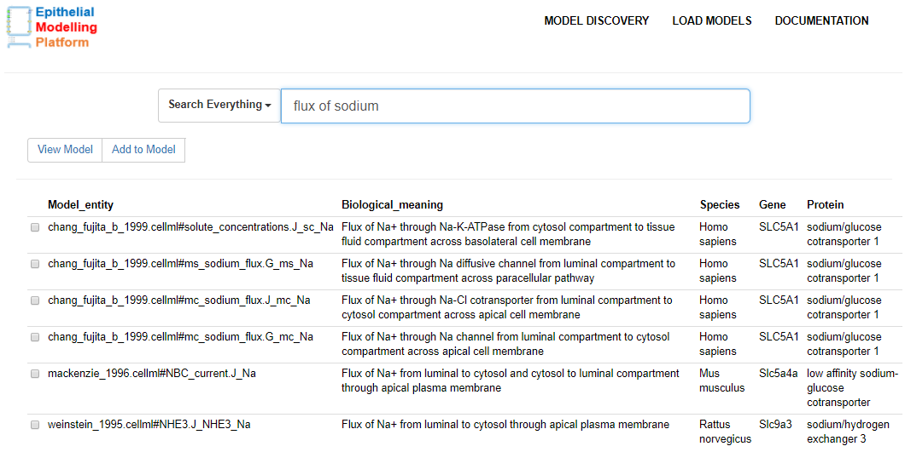
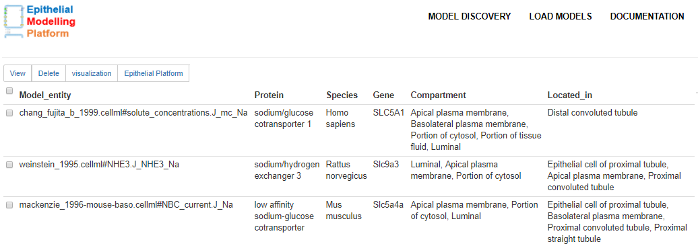
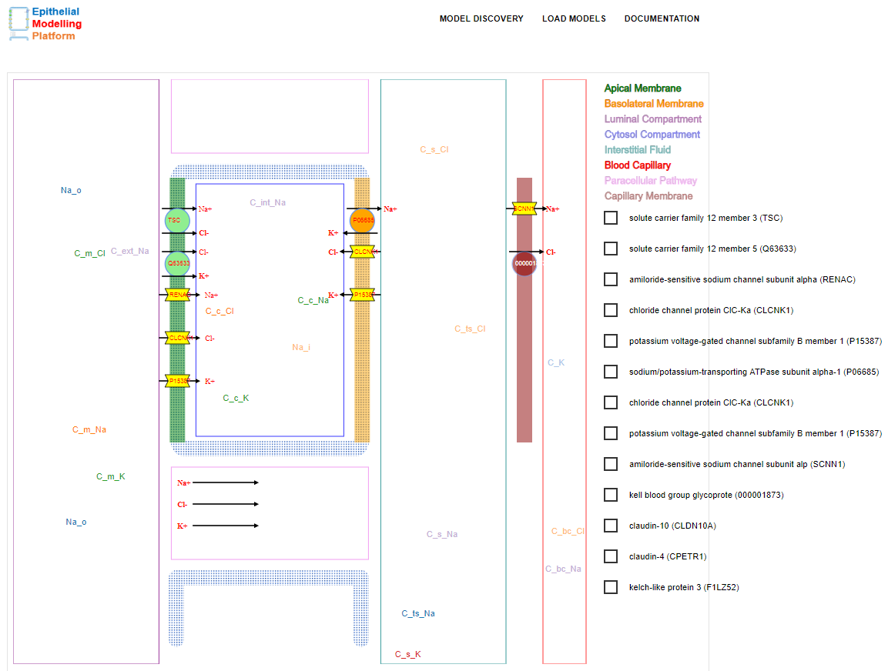
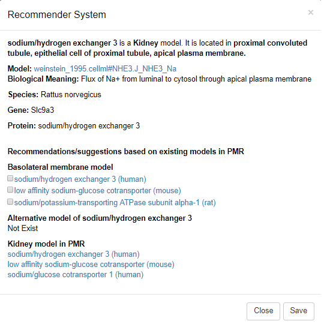
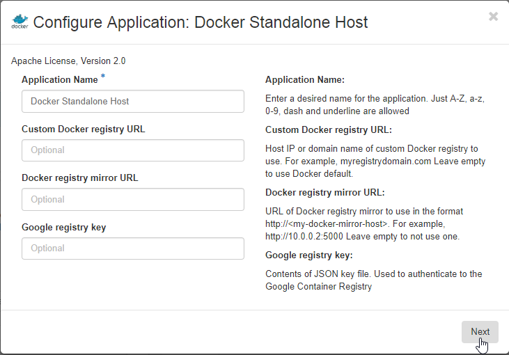
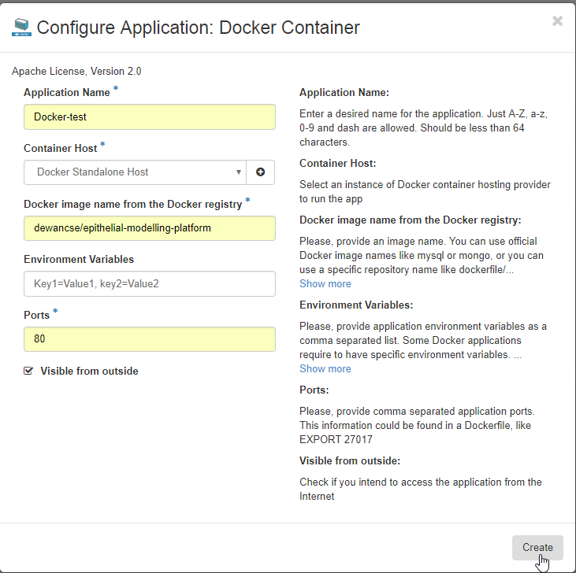

### Epithelial Modelling Platform (EMP)
Epithelial Modelling Platform is a web-based epithelial transport discovery, exploration and assembly tool. It allows users to discover, explore and assemble computational models for investigating their experimental or clinical hypotheses. In particular, this platform will aid biologists and clinicians to test their clinical or experimental hypotheses for a given collection of disparate mechanisms and/or observations such as diseases, drug actions and clinical observations. This tool is deployed at this address: http://epithelial-modelling-platform.nectar.auckland.ac.nz; as a demonstration of the capabilities described is the paper: LINK TO PREPRINT HERE?.

### Installing EMP
This tool makes use of webservices provided by [PMR](https://models.physiomeproject.org) as well as several services from the [European Bioinformatics Institute (EBI)](https://www.ebi.ac.uk/services). In oder to develop web applications which make use of services in this way, it is best to make use of a reverse proxy to ensure the web application plays nicely with modern web browsers. In this project, we use a Docker-based [NGINX](http://nginx.org/) reverse proxy for this purpose, which makes it reasonably easy to get this demonstration up and running locally as well as deploying it on various cloud platforms.

If you have Docker and git installed on your machine, then the following should get you up and running:
```
git clone https://github.com/dewancse/epithelial-modelling-platform
docker build -f Dockerfile -t unique-name/mdt-nginx .
docker run -d -p 80:80 -p 8000:8000 unique-name/mdt-nginx
```
Here EMP is running at port 80 and model composition service is running at port 8000. Due to have technical issues, users have to login to the docker container and manually execute the `entrypoint.sh` script in the background to initiate nginx and python server. Note that python server receives the assembled models, which are visualized on the modelling platform of the EMP, and then performs model composition.
```
docker ps (to see the container_id)
docker exec -it container_id /bin/sh
nohup ./entrypoint.sh &
enter and exit 
```
And then http://localhost:80 should work.

### EMP workflow

#### Discover Relevant Entities
The first step is to discover entities in PMR relevant to your interests. The discovered entities are typically components or variables in CellML models, but as the annotated content on PMR continues to grow the pool of potentially relevant entities similarly grows. With our current focus on epithelial transport in the kidney, this demonstration is tuned toward the kinds of entities most commonly found in models of such systems - e.g., fluxes of solutes typically found in renal epithelial cells (sodium, potassium, chloride...) and processes occuring in, or between, the lumen, cytosol, and interstitial compartments.

Presented in the screenshot below is an example of discovered entities from PMR for the entered text `flux of sodium`. From these results, the user can access further information on each discovered entity to help them determine which may be most relevant to their work. The additional information usually consists of the name of the model, component name and variable name; associated biological information about the entity deposited in PMR; protein names; and species and genes used during the experiments. For further investigation, we have provided two options:

- `View Model` to explore detailed information of a model 
- `Add to Model` to make a collection of models to be considered for visualisation, graphical editing and model asssembly.

However, the user can come back and rediscover more models by navigating to this `MODEL DISCOVERY` page.

 
*A screenshot illustrating an example EMP session, where the user has queried for any entities relevant to the text "flux of sodium".*

#### Input Handling
We would like users to be able to enter the "plain text" description of what they are interested in, but currently the entered text needs to be converted to one or more semantic queries executed against the PMR knowledgebase. In the future, we are looking to integrate tools such as Natural Language Processing to automate this conversion. Currently we define a dictionary of common phrases that the potential users of renal epithelial cell models might be interested in and use that to map the entered text to the semantic queries. Therefore, mapping follows the *exact match* principle. It is case insenstitive and users have to include the following terms when searching for a model:

| Physical entity | Physical process | Solutes |
| --- | --- | --- |
| `concentration` | `flux` | sodium, chloride, potassium, hydrogen |

#### Collection of Discovered Models
After discovering a range of models, user will select some models of interests and store these into a separate list, as presented below in the screenshoot. In this case, we have provided the following options: 

- `view` to explore detailed information of a model
- `delete` to remove model(s) from the list if the user is unhappy
- `visualisation` to visualise a comparison between models species, genes, compartments and anatomical locations
- `Epithelial Platform` to visualise a collection of selected models for visualisation, graphical editing and model assembly on the SVG-based Epithelial Platform.

 
*A screenshot illustrating an example EMP session, where the user has made a collection of models for visualisation, graphical editing and model assembly.*

#### Model Similarity
By using this feature, user can easily find similar component between models' species, genes, compartments and anatomical locations. As can be seen in the screenshot below, Weinstein and Mackenzie models have common `compartment`.

 
*A screenshot illustrating an example EMP session, where the user has made a comparison between models' species, genes, compartments and anatomical locations.*

#### Modelling Platform
This platform has been semantically generated and visualised based on the collection of models in the `LOAD MODELS` page. Following screenshoot illustrates the generated models’ component with circles, polygons and line with arrows. This platform consists of three membranes: apical, basolateral and capillary; and five compartments: luminal, cytosol, paracellular pathway, interstitial fluid and blood capillary. Each of these has been depicted with a unique color on the top-right corner of the platform.

Solutes of concentrations float within a specific compartment and solutes of fluxes have been placed on either apical, basolateral, or capillary membrane based on the annotated information in PMR. For example, presented below in the screenshot, flux of Na+ and flux of Cl- are flowing from luminal to cytosol compartment across apical membrane and through NaCl cotransporter. In order to distinguish physical entities and processes, we have represented them with the following shapes:
- `single fluxes` and `cotransporters` with `circles`
- `channels` with `polygons`
- `diffusive fluxes` in the paracellular pathway with a `text` and an `arrow`. 

On the right, a list of checkboxes have been generated for each of these shapes, i.e. physical entities and processes. User can tick a checkbox and then drag and drop the associated fluxes across the apical or basolateral membrane. For example, user can drag the NaCl cotransporeter from the apical membrane, as shown in the screenshot below, and drop on the basolateral membrane in order to get useful suggestions which is discussed below in the `Recommender System` section.

 
*A screenshot illustrating an example EMP session, where the user has visualised an instance of the Epithelial Platform for graphical editing, as well as model assembly in order to make a new Epithelial Model.*

#### Recommender System
As part of the additional information available for the discovered entities, a recommender system has been implemented to present the user with additional entities in PMR that may be of interest. As with the rest of this tool, the recommender system is currently very renal epithelial transport focussed, but the implementation will be easily extendable to a wider range of physiology as the available semantic knowledge in PMR grows.

This system will appear as a window when user will drag and drop a model across the apical or basolateral membrane. Presented below is an example of a CellML model entity - `flux of sodium` in the weinstein model after dragging from apical to basolateral membrane. Initially this system gives a brief description of the dragged model followed by some suggestions from the annotation in PMR. By using this system, user will get existing basolateral membranes with the sodium solute. Also, alternative models of this model from various workspaces, and related kidney models have been provided for further exploration. User can choose one of the models from this system as a replacement of the dragged model.



*A screenshot illustrating an example recommender session, where the user has dragged the Weinstein model from apical to basolateral membrane.*

## Docker Image in Nectar Cloud
We have deployed our Docker image to Nectar Cloud. In order to begin with the deployment process, please navigate to [Dashboard](https://dashboard.rc.nectar.org.au/auth/login/) in Nectar Cloud and provide login credentials. As a student at the University of Auckland, I have provided my login credentials, as illustrated below. Following screenshots are examples of our Docker image's deployment to Nectar. Please read texts below of each screenshot to know in details.  

 

*A login screen, where the user will choose either NZ or Australian.*


*A screenshot illustrating my federation and organization details.*


*An example Docker setup session, where the user will click "Quick Deploy" to begin with a session.*


*Fill out an application name, a docker image name from the Docker registry, and a port number for the docker container. Then click "Add Application".*



*Enter an application name and the remaining fields are optional. Then click "Next".*


*Choose the Ubuntu instance name from the dropdown menu, along with your key pair and availability zone. Follow this [key pair](https://support.ehelp.edu.au/support/solutions/articles/6000055376-launching-virtual-machines#Keypair) document to create a key pair, which will appear here under the key pair dropdown menu. Then click "Create".*



*Click "Create" to setup an environment for the Docker container.*


*Then click "Deploy This Environment" to begin with a deployment session.*


*Lastly, navigate to the IP address with the port number mentioned in the screenshot to visit the up and running docker image. Note that the user can apply for a DNS host name for this IP address to Nectar support team [Ask For Help](https://support.ehelp.edu.au/support/home).*

### Accessibility
The application is accessible by navigating::
```
  http://epithelial-modelling-platform.nectar.auckland.ac.nz or http://130.216.216.81
```

### Programming Language
- JavaScript
- SPARQL

### Limitations
We will implement Unit testing and Functional testing to make sure the code is functioning as expected. While the underlying tools are not specific to renal epithelial transport, the currently supported text-to-query mappings and recommender system are very specific to renal epithelial transport.
### List of contributors
- Dewan Sarwar - @dewancse
- David Nickerson - @nickerso

### Licencing
MIT license!

### Acknowledgements
This project is supported by the MedTech Centre of Research Excellence (MedTech CoRE), the Aotearoa Foundation, and the Auckland Bioengineering Institute.
